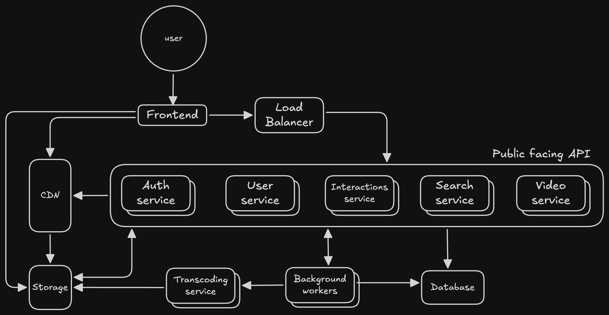

# Strimin - A Video Streaming Platform

## Preamble
The objective is to design a video-sharing and streaming platform, a YouTube "clone", with the following business context:
You will have 5 developers to build and maintain this product and system
You are expected to have a public release of this product and system in 6 months
We expect, on average, somewhere between 20,000 and 50,000 Daily Active Users
These users are mainly concentrated in Canada and Europe

## Architecture

### System diagram

### Technologies for MVP and their rationale
#### Cloud platform: AWS
- Since the userbase is going to be split between 2 continents, AWS is a strong choice because it offers reliable, global infrastructure in both Canada and Europe, ensuring low latency and data compliance. Its managed services make it easy to scale efficiently as userbase grows

#### Frontend: React, Vite SPA
- React is the industry standard for modern, interactive SPAs. Huge ecosystem, battle-tested, and a large hiring pool. Vue and Angular are also viable options, but they are more niche (Vue) and more opinionated/heavyweight (Angular)
- Vite offers lightning-fast local dev (thanks to native ES modules and HMR) and modern build optimizations for production (tree-shaking, code splitting)
- SPA model suits content-rich, dynamic applications like video platforms, with client-side routing and efficient state management

#### Backend: NodeJS microservices, Express/Fastify
- Node.js is ideal for I/O-heavy, real-time web services.
- Microservices pattern means each domain (auth, user, interactions, search, video) can scale independently and be deployed separately, and have clear separation of concerns
- Express is ever-lasting, simple, and mature. Large ecosystem. It might be a bit outdated, as several other frameworks have become popular in the past few years. Which is why I would also suggest
- Fastify as a modern and performance-oriented alternative. It outperforms Express in benchmarks, has better TypeScript support, and has strong plugin ecosystem

#### Database: PostgreSQL for Relational DB, DynamoDB for NoSQL DB
- PostgreSQL is the gold standard for relational data with strong consistency, advanced queries, and extensibility. Ithandles complex schema relationships (users, videos, comments, likes, etc.) elegantly. Managed AWS RDS and Aurora offer high availability, backups, autoscaling, and failover out-of-the-box
- DynamoDB is a great choice for key-value storage because it’s fully managed, extremely fast at scale, and requires zero operational overhead. Its elastic design allows to handle high-velocity, low-latency workloads - like sessions, caching, or feature flags - avoiding creating too much stress on the relational database

#### Object storage: S3
- S3 is the right choice for video storage because it provides virtually unlimited, highly durable object storage with automatic redundancy across multiple facilities, ensuring the videos are safe and always accessible. It has seamless scalability, integrated lifecycle policies, and global delivery via AWS CloudFront, which make it ideal for efficiently storing, serving, and managing large volumes of video content

#### Authentication: Clerk
- I would start by scratching out the option of rolling our own auth: it comes with too many caveats that would take way too much time out of the 6 months available. Handling username/password, different social logins workflows, 2FA on top of ensuring security and compliance has very few pros and many cons
- Of the auth SaaS I considered (Clerk, Auth0, Okta) I would go with Clerk: The pricing for other two with the expected daily users on the platform would increase substantially (3x/4x more)

#### Miscellaneous: CDN, Load Balancing, Background workers
- CDN can be used to more easily and quickly deliver static assets. On top of that, it can be used to cache most requested videos to lower S3 egress costs
- Due to the expected DAU, a load balancing service should be implemented: AWS Application Load Balancer would fit well in this context, especially since its path-based routing allows us to avoid having to place NGINX servers in front of our API (_if_ custom header manipulation isn't necessary)
- Background workers will be necessary for for processing all kinds of tasks: transcoding, notifications, analytics, thumbnail generation, cron jobs

### How to run the project
#### Backend setup:
1. run `cp ./backend .env.example .env`
2. Register to Pixabay and obtain an API key here: https://pixabay.com/api/docs/
3. Register to Clerk, create an application, obtain Publishable and Secret keys
4. Place the obtained keys in the `.env` file created on step 1

#### Frontend setup:
1. run `cp ./frontend .env .example.env`
2. Grab the Clerk Publishable key and paste it in the only env variable available

#### Running the project:
1. run `npm install:all`
2. run `npm build:all`
3. run `npm start:all`

Frontend will be available at `http://localhost:4173/`. Backend will be available at `http://localhost:3000/`

### Disclaimers
I have a lot of regrets with the 3rd party API for the video sources:
- API video data lacks a lot of information that would've been useful (video title)
- API is only available for pictures and videos, nothing to return user data
- Videos API parameters do not filter by user

The backend is built with [Hono](https://hono.dev/) as it comes with a lot of functionalities built-in. It was a lot of fun working with it!
If I had more time, I would've organized the backend better: controllers, services, repositories.
I used sqlite because it's easy to use, it's supported by the orm I chose to use (drizzle) and it doesn't require additional setup to be ran locally.

For some frontend styling implementation I made use of Vercel's v0 platform - just so that you don't think I'm a css wizard.
I'm a big fan of Tanstack Query. I made use of some of its features but it can offer so much more.